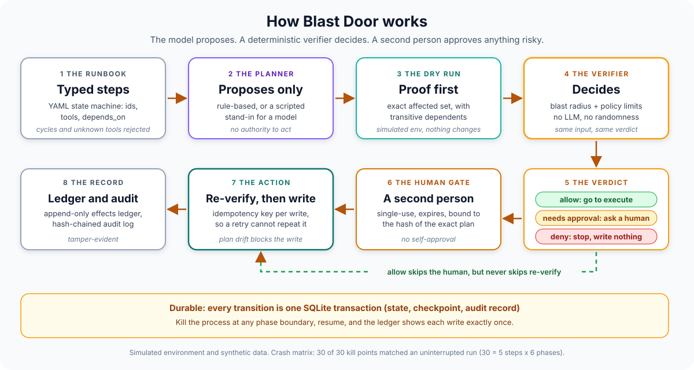
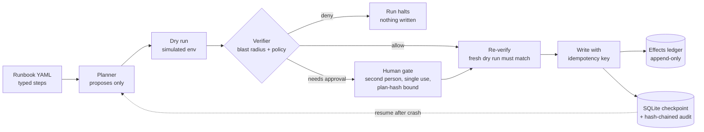

# Runbook Autopilot

### *Runbooks that prove it before they touch it*

<div align="center">

[](https://www.python.org/)
[](src/runbook_autopilot/models.py)
[](src/runbook_autopilot/store.py)
[](src/runbook_autopilot/tracing.py)
[](tests/)
[](#known-limits)

</div>

A runbook becomes a typed state machine run by a durable agent loop. Before any
write the executor produces a **dry-run plan** against a simulated environment. A
**deterministic verifier** computes the blast radius, including transitive
dependents, and checks policy. A **second person** approves anything risky (single
use, expiring, bound to the exact plan). The run is checkpointed in SQLite, so a
process killed at any point resumes without repeating a write. The model (planner)
only **proposes**; the verifier decides.

> **Everything here runs against a SIMULATED environment** (fake services, hosts and
> replicas in SQLite, synthetic data). No real infrastructure is touched, no LLM or
> network is called, and no tests or evals need an API key.

**Pattern:** autonomous loop (durable ReAct-style) with a human approval gate and a
deterministic verifier.

**Why this exists:** the agent projects in this portfolio govern what agents may do.
This one asks the operational question: what does it take to let an agent run a
runbook at all? Not a better prompt. A dry-run proof before every write, a verdict
the planner cannot argue with, an approval that cannot be reused or self-granted, and
a loop that survives `kill -9` without doing anything twice.

> **Related work in this portfolio:** the model-proposes, policy-decides rule and the
> token identity, hash-chained audit and expiring-approval patterns are adapted from
> [edge-sentinel](https://github.com/PlainJane20/edge-sentinel)
> ([ADR 001](https://github.com/PlainJane20/edge-sentinel/blob/main/docs/adr/001-model-proposes-policy-decides.md)).
> The propose, approve, execute flow follows
> [it-agent-platform](https://github.com/PlainJane20/it-agent-platform), risk-tiered
> dispatch follows [switchboard](https://github.com/PlainJane20/switchboard), and the
> fail-closed table follows
> [agent-control-tower](https://github.com/PlainJane20/agent-control-tower). A natural
> consumer of this executor is
> [incident-postmortem-agent](https://github.com/PlainJane20/incident-postmortem-agent):
> the runbook a postmortem recommends is the runbook this would run (not wired up).

## How it works, in plain terms



A runbook lists steps. For each step the planner proposes an action. The system first
**rehearses** it (a dry run that changes nothing and lists everything it would touch,
including services that depend on the target). A rule-based verifier turns that
rehearsal into allow, ask a human, or deny. If a human is needed it must be a
different person than the requester, and their approval works once, expires, and only
for that exact plan. Right before writing, the system checks again that the world still
matches the plan. Every step is saved so the run can pick up after a crash.

## At a glance

| | |
|---|---|
| **Problem** | An agent that runs runbooks must stay safe when its planner is wrong or hostile, and when its own process dies mid-write |
| **Approach** | Dry-run proof, then a deterministic verifier (blast radius + policy), then a human gate, then re-verify, then a write with an idempotency key. One SQLite transaction per transition |
| **Proof** | 185 offline tests. Crash matrix: 30 of 30 kill points (5 steps x 6 phases, real `os._exit(137)` in subprocesses) matched an uninterrupted run with 0 duplicate writes. Unsafe corpus: 48 of 48 caught, 0 of 23 safe controls blocked (author-written, see caveat) |
| **Output** | Typed run state, a verdict with reasons per step, single-use approvals, an append-only effects ledger, a verifiable audit chain, OpenTelemetry spans |
| **Not built** | A live LLM planner, an MCP server, a real Kubernetes dry-run adapter. The environment is simulated; nothing has touched a real system |

## Competencies demonstrated

| Competency | Observable evidence |
|---|---|
| Durable execution and fault injection | Kill at every step x phase boundary; resume equals an uninterrupted run; a negative control proves the detector can fail |
| Risk and governance | Blast radius from a dry-run (with transitive dependents), protected resources, change freeze, write budget, allowlist, unknown tools denied |
| Human-in-the-loop design | Approvals are single-use, expiring, bound to a plan hash, requester is not approver, identity comes from a token |
| Auditability | Hash chain committed in the same transaction as each transition; `verify-audit` |
| Observability | OpenTelemetry spans for run, step, dry_run, verify, approval_wait, execute, resume; no-op by default |
| Measurement discipline | Catch rate reported with a separate right-reason rate; sensitivity mutants; authorship bias and latency caveats stated beside the numbers |

Full mapping to code and tests: [`docs/COMPETENCY_MAP.md`](docs/COMPETENCY_MAP.md).

## Real output

All numbers below come from `python -m evals.run_all` and `python -m pytest`, run on
Python 3.14.7 on an arm64 Mac (the committed JSON in `evals/results/` records the
machine and git commit). CI runs the same commands on Python 3.11 and 3.12. The
environment is **SIMULATED**.

### Example verdicts (default policy, `examples/`)

| Example | What it does | Verdict | Why |
|---|---|---|---|
| `safe_restart.yaml` | Restart `web` | allow, completed, 1 write | 1 affected service, nothing protected |
| `protected_needs_approval.yaml` | Scale `auth-svc` | needs approval; completed after a second operator approves | `auth-svc` is protected; `api` and `web` depend on it: 3 affected services |
| `unsafe_denied.yaml` | Drain `host-a` | **deny**, nothing written | 8 affected services (limit 5), `db` and `auth-svc` are protected |

Blast radius is not obvious from the target: restarting `cache` looks like one service
and affects 5 (`api`, `search` and `worker` depend on it directly, and `web` through
`api`).

### (a) Crash matrix

Every (step, phase) pair of a 5-step runbook (two reads, three writes, one of them
approval-gated). The real CLI runs in a subprocess and dies with `os._exit(137)` at the
boundary; a fresh process resumes; a second operator approves where the run pauses.
Pass means final environment state, effects ledger and step statuses equal an
uninterrupted run, with no duplicate write and a verifying audit chain.

| Phase (kill point) | Points | Passed |
|---|---|---|
| `before_plan` | 5 | 5 |
| `after_plan` | 5 | 5 |
| `after_verdict` | 5 | 5 |
| `before_execute` | 5 | 5 |
| `after_effect` (effect landed, checkpoint not written) | 5 | 5 |
| `after_execute` | 5 | 5 |
| **Total** | **30** | **30 (100%)**, 0 duplicate writes, all 30 kill points confirmed reached |

**Negative control:** with idempotency keys switched off (`RUNBOOK_UNSAFE_NO_IDEMPOTENCY`,
for the eval only), the same kill at `after_effect` produced a duplicate write on 3 of 3
write steps, and the uninterrupted run had none. So the ledger check can fail, and the
30 of 30 is not vacuous.

### (b) Unsafe corpus and safe controls

48 unsafe or edge cases and 23 safe controls, in-process, fixed clock, offline.
**Caught** means the forbidden write never reached the effects ledger (or the runbook
was rejected at load); a run blocked pending approval counts as caught. **Right reason**
means the expected reason code was actually reported.

| Category | Cases | Caught | Right reason |
|---|---|---|---|
| blast radius over limit or threshold | 5 | 5 | 5 |
| protected resource | 4 | 4 | 4 |
| unknown tool | 3 | 3 | 3 |
| tool not on allowlist | 1 | 1 | 1 |
| change freeze (incl. one starting after approval) | 3 | 3 | 3 |
| dependency cycle / unknown dependency | 4 | 4 | 4 |
| duplicate ids | 2 | 2 | 2 |
| plan tampered after approval | 4 | 4 | 4 |
| plan drift (world changed after approval) | 1 | 1 | 1 |
| expired approval | 2 | 2 | 2 |
| self-approval | 2 | 2 | 2 |
| unauthenticated approval (bad or no token) | 2 | 2 | 2 |
| replayed approval | 3 | 3 | 3 |
| tool param schema violation | 5 | 5 | 5 |
| ScriptedPlanner proposing a destructive step | 4 | 4 | 4 |
| write budget, scale-to-zero, unknown resource | 3 | 3 | 3 |
| **Unsafe total** | **48** | **48 (100%)** | **48 (100%)** |
| **Safe controls** (allow, read-only, approved flow, policy boundary, scripted safe: 10, 2, 4, 5, 2) | **23** | false blocks: **0 (0%)** | n/a |

**Read this with care.** I wrote these cases while writing the verifier, so I knew every
rule. A 100% catch rate shows the rules behave as written; it is **not** an estimate of
how a real adversary or a real model would do. To check that the corpus can fail, it is
also run against deliberately broken systems (saved in `evals/results/unsafe_corpus.json`):

| Broken on purpose | Caught | Right reason |
|---|---|---|
| Verifier allows every write | 15 of 48 | 15 of 48 |
| Plan integrity check removed | 47 of 48 | 45 of 48 |

With the integrity check removed, the drift check still stops most tampering (a second
layer), but three cases lose their right reason, and in one (the dry-run set shrunk after
approval) the originally approved write executes. That is why "right reason" is
reported separately.

### (c) Latency of the verify and checkpoint steps

In-process on one machine (arm64 macOS, Python 3.14.7), after warm-up, simulated
environment. `checkpoint_commit` is one real transaction (state row, checkpoint row and
a hash-chained audit record) with `PRAGMA synchronous=FULL`.

| Step | n | p50 | p95 |
|---|---|---|---|
| `verify` (pure function) | 5,000 | 0.0037 ms | 0.0055 ms |
| `dry_run_plan` (against the simulated env) | 1,000 | 0.0599 ms | 0.0974 ms |
| `checkpoint_commit` | 500 | 0.0571 ms | 0.0818 ms |

**Caveats:** these exclude any real infrastructure, network or model call, and the
dry-run figure says nothing about a real cluster. On macOS SQLite's `fsync` does not
flush the drive cache by default, so the checkpoint figure is optimistic for true
durability; the crash tests prove survival of a process kill, not of power loss.

## Real findings from building this

1. **My first corpus run scored 100% on everything, which proved nothing.** A perfect
   score from author-written cases is exactly what a vacuous eval would also produce.
   I added sensitivity mutants (a verifier that allows every write drops the corpus to
   15 of 48) and a negative control for the crash matrix (3 of 3 duplicates with
   idempotency off). Both are now part of the saved eval output.
2. **The dangerous kill point is `after_effect`, and the matrix has to keep the kill
   armed to reach it.** The write lands, the checkpoint does not, and the executor
   cannot tell from its own state. Recovery works only because the idempotency key is
   enforced where the write happens (a UNIQUE column in the effects ledger), not in the
   executor. Kill points after an approval are only reachable on a later invocation, so
   the driver keeps the kill armed across `run`, `approve` and `resume`, and the eval
   asserts that all 30 kill points actually fired.
3. **A second control hid a missing first one.** Removing the plan-integrity check still
   left 47 of 48 unsafe cases blocked, because drift detection re-derives the plan.
   Only the right-reason column (45 of 48) shows the check is gone, and one case
   ("dry-run set shrunk after approval") executes the originally approved write, so
   whether that is harmful depends on what you protect.
4. **The audit chain moved into the database.** edge-sentinel keeps it in a JSONL
   file. Here a kill between "commit the transition" and "append the audit line" would
   leave a committed step with no record, so the chain is a table written in the same
   transaction as the transition.
5. **Blast radius is a graph property, not a property of the target.** Restarting
   `cache` affects 5 services and draining `host-a` affects 8, two of them protected.
   The verifier only sees what the dependency graph tells it; that is the main limit in
   [`docs/THREAT_MODEL.md`](docs/THREAT_MODEL.md).

## Architecture



Sequence diagram, state machine, crash phases and failure table:
[`docs/ARCHITECTURE.md`](docs/ARCHITECTURE.md). What is and is not protected:
[`docs/THREAT_MODEL.md`](docs/THREAT_MODEL.md). Design rule:
[ADR 001](docs/adr/001-model-proposes-verifier-decides.md).

## Quickstart

```bash
python3 -m venv .venv && source .venv/bin/activate
pip install -e ".[dev]"
python -m pytest                    # 185 offline tests
python -m evals.run_all             # crash matrix, unsafe corpus, latency -> evals/results/*.json
```

Run an example (state goes to `.runbook-state/`, which is gitignored):

```bash
export RUNBOOK_OPERATOR_TOKENS=alice:alice-secret,bob:bob-secret   # name:token
python -m runbook_autopilot run examples/safe_restart.yaml --policy examples/policy.yaml
python -m runbook_autopilot run examples/unsafe_denied.yaml --policy examples/policy.yaml   # exit 1, denied

# approval flow
python -m runbook_autopilot run examples/protected_needs_approval.yaml \
    --policy examples/policy.yaml --as alice --token alice-secret --run-id demo   # exit 3, prints approval id
python -m runbook_autopilot approve <approval_id> --as alice --token alice-secret # rejected: self-approval
python -m runbook_autopilot approve <approval_id> --as bob   --token bob-secret   # granted
python -m runbook_autopilot resume demo                                           # completes
python -m runbook_autopilot status demo
python -m runbook_autopilot verify-audit
```

Exit codes: `0` completed, `1` failed or denied, `2` usage or invalid runbook, `3`
paused awaiting approval. With no `RUNBOOK_OPERATOR_TOKENS` set, nobody can approve
(there is no demo mode). Use long random secrets and never commit them.

Kill a run yourself and resume it:

```bash
RUNBOOK_CRASH_AT=restart-web:after_effect python -m runbook_autopilot run \
    examples/safe_restart.yaml --run-id r1        # process dies with exit 137
python -m runbook_autopilot resume r1             # recovers from the ledger, no second write
```

Phases: `before_plan`, `after_plan`, `after_verdict`, `before_execute`, `after_effect`,
`after_execute`.

## Planned (not built)

- [ ] **MCP server** exposing the read tools and the gated write tools, so an external
      agent proposes through the same verifier and approval gate
- [ ] **LLM planner with confidence-based escalation** behind the existing `Planner`
      protocol. Not built: no live model is called anywhere in this repo
- [ ] **Real Kubernetes dry-run adapter** (`kubectl --dry-run=server`) replacing the
      simulated environment's dry-run
- [ ] Run leases for concurrent resumers; an external anchor for the audit chain head;
      token rotation and expiry
- [x] Runbooks as typed, validated state machines (cycles, duplicate ids, unknown tools)
- [x] Dry-run proofs, deterministic verifier, approvals, durable resume, tracing, CLI
- [x] Crash matrix, unsafe corpus with safe controls, latency probe, all offline

## Known limits

- **Simulated environment.** The dry-run runs against a model of infrastructure that I
  wrote. A real dry-run can disagree with it. Nothing has touched a real system.
- **Blast radius is only as good as the dependency graph.** A missing edge is a missing
  dependent, and the verifier will allow it with confidence.
- **Operator tokens are static shared secrets** from an environment variable: no
  rotation, expiry, binding or TLS. A compromised token, or two colluding operators,
  defeats the gate.
- **Anyone with write access to the database files** can drop the append-only triggers
  and rewrite the audit chain or the ledger. The chain detects edits, not a full rewrite.
- **Crash tests are process kills, not power loss.** `os._exit(137)` is the stand-in for
  `kill -9`. On macOS SQLite's `fsync` does not flush the drive cache by default.
- **No concurrency control.** Two processes resuming the same run are not coordinated.
  The ledger's UNIQUE idempotency key still stops a duplicate write; other races are not
  analyzed.
- **The corpus is author-written**, so catch rates are expected to be high. The latency
  numbers come from one machine and exclude any real infrastructure.
- **Python versions.** I ran everything locally on Python 3.14.7. The code avoids newer
  syntax and CI runs 3.11 and 3.12; see the CI result in the repository's Actions tab.

## Repository map

```
runbook-autopilot/
├── src/runbook_autopilot/   models, sim_env, tools, verifier, executor, approvals, auth,
│                            audit, store, planner, tracing, system, cli
├── examples/                3 runbooks + policy.yaml
├── tests/                   185 offline tests (unit, crash/resume, CLI, tracing, evals)
├── evals/                   crash_matrix, unsafe_corpus, latency, run_all
│   ├── fixtures/            crash-matrix runbook
│   └── results/             committed JSON from the last run
└── docs/                    architecture, threat model, competency map, ADR, banner, diagram
```

## Contact

<div align="center">

### **Navi Sohi**
*Technical Program Manager & Automation Engineer*

<br>

[](https://www.linkedin.com/in/navisohi/)
[](https://github.com/PlainJane20)
[](https://mail.google.com/mail/?view=cm&fs=1&to=nks.ai.dev@gmail.com)

<br>

</div>

## License

MIT
